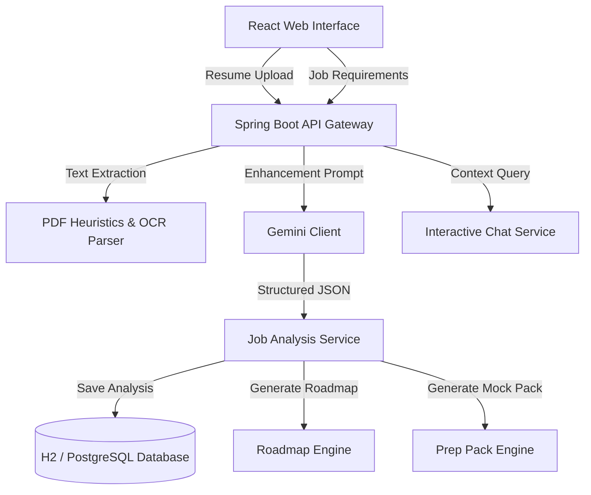

# CareerPilot AI - AI-Powered Employability Platform

**CareerPilot AI** is a premium, production-grade employability audit platform built specifically for final-year engineering students and fresh graduates aiming to secure software engineering roles. It performs a comprehensive, multi-dimensional analysis of a candidate's resume against a target job description, identifying critical gaps and creating customized readiness plans.

---

## 🚀 Key Features

* **Multi-Stage Resume Parsing:**
  * Extracts candidates' names, personal emails, phone numbers, complete educational credentials, and skills.
  * Includes a robust local OCR heuristics fallback that filters reference contact details (e.g. CDC placement directors) and extracts candidate details with high precision.
* **Match & ATS Analytics:**
  * Compares resumes against job descriptions to calculate **Career Readiness**, **Job Match Alignment**, and **ATS Compatibility** scores.
  * Lists matching skills, missing skills, and resume format improvements.
* **Bespoke 30-Day Learning Roadmap:**
  * Generates a sequential learning timeline targeting missing competencies.
  * Breaks down weekly milestones and daily concrete deliverables.
* **Bespoke Interview Prep Pack:**
  * Generates custom technical, HR, and project-specific mock questions with comprehensive answers.
* **Interactive Career Twin Chat:**
  * Context-aware chatbot assistant enabling graduates to ask follow-up questions about their career readiness and skills.

---

## 🛠️ Tech Stack

* **Backend:** Java 17+, Spring Boot 3.3.0, Spring Data JPA, Maven, Spring Web, Jackson, H2 / PostgreSQL.
* **Frontend:** React, Vite, Tailwind CSS, Lucide Icons.
* **AI Engine:** Google Gemini API Integration with robust JSON cleaning fallback.
* **Database:** Embedded H2 Database (local development) and PostgreSQL (production).

---

## 🏗️ Architecture



---

## 💻 Local Setup & Development

The platform is designed to run in a unified mode on a single port for zero-setup execution:

### Prerequisites
* Java JDK 17 or 18
* Node.js (v18+)
* Maven (v3.8+)

### Step 1: Run the Unified Server
Navigate to the `backend` directory and run:
```bash
mvn spring-boot:run
```
This starts the Spring Boot server on `http://localhost:8080/`. The backend serves the built React assets statically and exposes all APIs, running on a local H2 file database located at `./data/careerpilotdb`.

### Step 2: Access the Console
* **Web Application:** Open [http://localhost:8080/](http://localhost:8080/) in your browser.
* **H2 Database Console:** Open [http://localhost:8080/h2-console](http://localhost:8080/h2-console) (JDBC URL: `jdbc:h2:file:./data/careerpilotdb`).

---

## 🐳 Deployment (Docker & Render)

The repository includes pre-configured Dockerfiles and a `render.yaml` template:

* **`Dockerfile.backend` & `Dockerfile.frontend`:** Multi-stage Docker builds to containerize the application.
* **`docker-compose.yml`:** Defines the multi-container configuration hosting both Spring Boot and PostgreSQL.
* **`render.yaml`:** Blueprint configuration to deploy directly to Render with a Managed PostgreSQL database.
